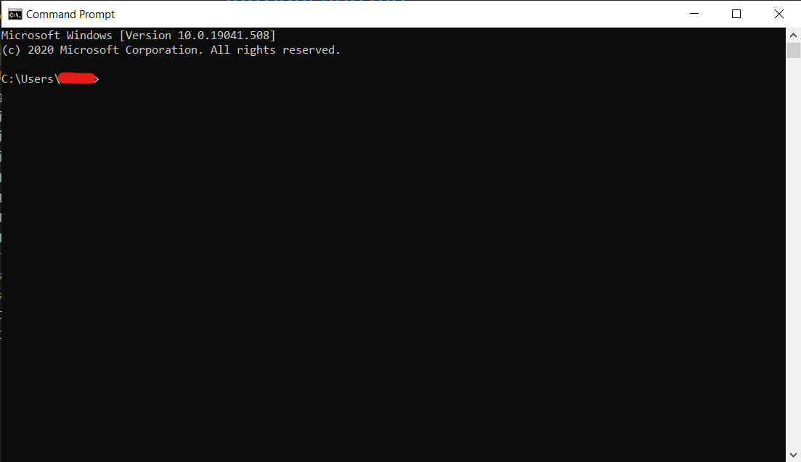
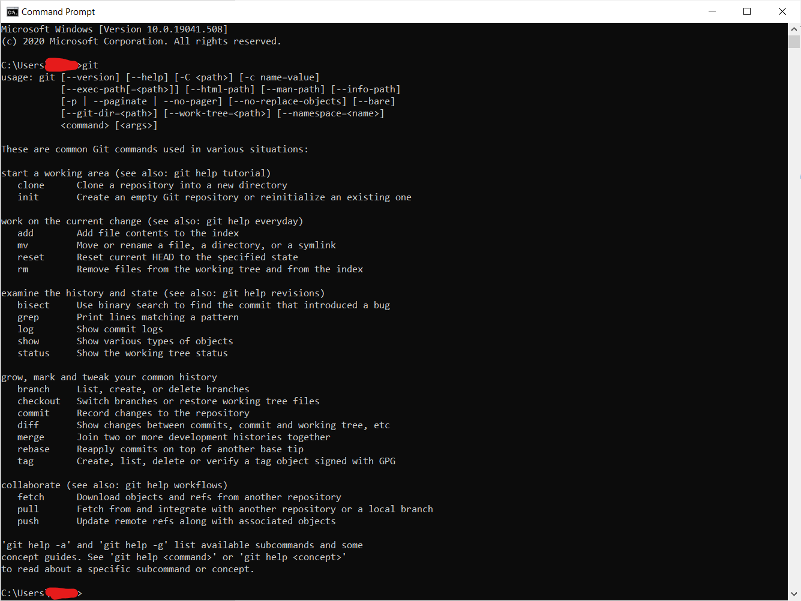
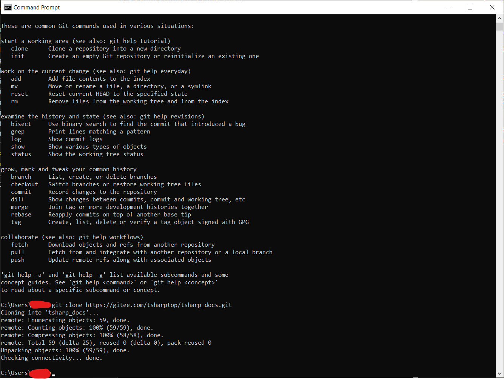

#! https://zhuanlan.zhihu.com/p/264814386

# [01-0-1] Git初步|向本仓库提交内容所需的软件

本文是供一些非软件开发者使用Git&vscode的文章，这部分人大多不需要使用这类工具作为日常工作的一部分，但是因为发现了tsharp_docs的问题希望提供帮助或者其他原因想要使用的，我们致力与在本文中为其提供帮助

## 软件安装：（Git）

### Windows平台：

请访问<https://gitforwindows.org/>来下载最新版本的`Git for Windows`

或者直接访问<https://git-scm.com/download/win>，都一样，不会对下面的操作有影响

安装过程都按照默认选项就可以了

安装完成之后我们按下`Windows key +S`，输入`cmd`，按下回车

这时候我们应该看到一个黑乎乎的东西，长这样

内容为：

    Microsoft Windows [Version 10.0.19041.508]
    (c) 2020 Microsoft Corporation. All rights reserved.

    C:\Users\xxxx>

输入`git`，按下回车，如果这个窗口变成了这样，说明安装正确

这就是我们所说的`命令行`工具，因为大家不需要太多的操作，我们只需要学会一些简单的命令

### macOS平台：

macOS上面一般是默认安装了Git的，用下面的办法来检查

macOS和Windows上cmd类似，也存在着终端这个软件，打开LaunchPad，输入`terminal`（如果你的Spotlight搜索默认打开了，那你可以按下`Command+Space（空格）`来打开`Spotlight`，然后输入`terminal`）

现在你应该能看到如下画面：

输入git，如果出现以下画面你可以直接跳过下面步骤

如果没有，那么首先将如下命令复制到命令行里面：
> 安装Homebrew：

    /usr/bin/ruby -e "$(curl -fsSL https://raw.githubusercontent.com/Homebrew/install/master/install)"
> 安装Git:(Homebrew 自带)

    brew install git

### Linux平台：

Linux平台自带git，无需安装

## 软件安装：（vscode篇）

请到官网：<https://code.visualstudio.com/>上下载所需的软件，并安装以下插件：

    Gitlens
    LaTex workshop
    markdownlint
    Markdown All in One

## 使用git和vscode编辑文档

现在，先访问本项目主页：<https://gitee.com/tsharptop/tsharp_docs>

在刚才的命令行中，输入`git clone https://gitee.com/tsharptop/tsharp_docs.git`，等待一会，出现这样的画面时说明完成：

注意：不可以使用`Ctrl+C/V`来复制粘贴，在Windows下面使用右键来操作，在macOS上面使用`Command+C/V`来操作

这样，我们就把这个项目（下面简称`repo`）复制了一个一模一样的到你的电脑上（下面简称`clone`）

进入当前目录，使用命令`cd tsharp_docs`来进入`tsharp_docs`目录

使用命令`code .`来开启一个在当前目录的vscode

## 提交到远程仓库

为了向我们的`repo`做出贡献，你首先要注册一个`gitee`账户，访问这里：<https://gitee.com/signup>

然后访问我们项目的官网：<https://gitee.com/tsharptop/tsharp_docs>，点击右上角的Fork，这样你就创建了自己的分支

在本地项目进行编辑（或者直接使用Gitee上面的编辑器），使用如下命令将本地文件同步到Gitee（你Fork的仓库）上：

    git remote add origin <远程仓库地址（你自己的）>
    git push --set-upstream origin master

现在你每一次的操作都可以被`push`到远程仓库上面去，比如，当你在vscode上做出了更改以后，返回项目的根目录，使用以下命令来提交更改：

首先同步项目（从远程同步）：

    git pull
然后添加更改到工作区：

    git add .
提交更改（到本地）：（`-m`后面加上的参数是提交的信息）

    git commit -m "Update"
如果你已经学习过vim的用法，或者想更好的更改提交信息，使用以下命令
>
>        git commit
> 然后按下`i`，进入编辑模式，这时候你可以任意编辑
>
> 等到编辑结束，按下`esc`推出编辑模式，输入`wq`保存文件

然后，也是最后一步，使用`git push`命令提交到远程仓库（你的仓库）

接下来，访问项目的地址：<https://gitee.com/tsharptop/tsharp_docs>

点击上面的`Pull request`，选择需要同步的版本，点击确认

接下来，我们会审核您提交的内容，如果对社区有益，我们会合并操作，您提交的内容就会成为社区文档的一部分

## 感谢您为tsharp社区做出的贡献
