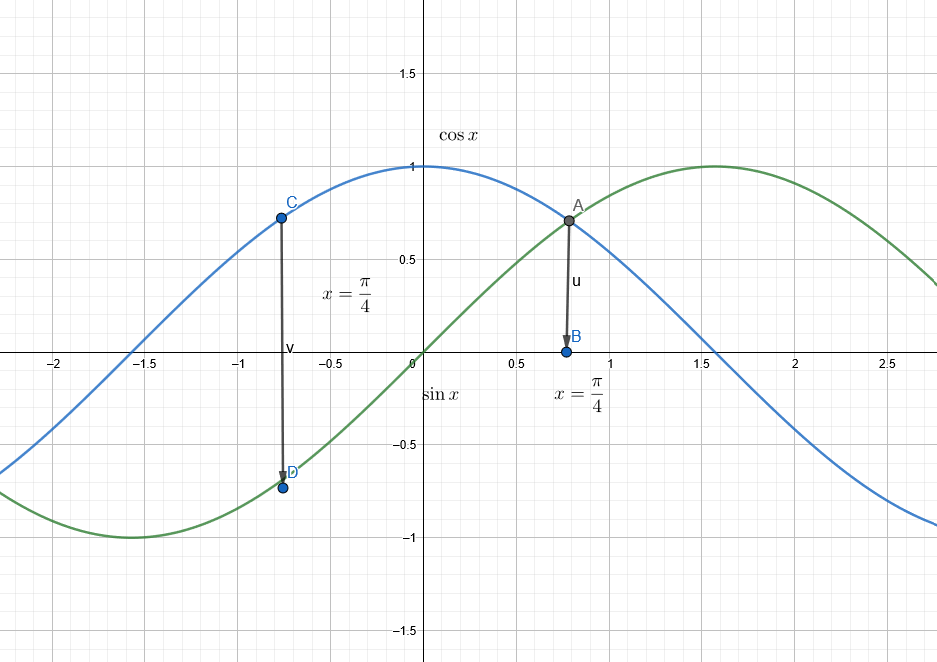

#! https://zhuanlan.zhihu.com/p/264525443

# [01-1-1] 解答|题目264525443：

$\int\frac{1}{\sqrt 2 +\sqrt{1-x}+\sqrt{1+x}}dx$

我说说自己的思路吧:

我觉得正常人先想到的是分母有理化：

$\int\frac{1}{\sqrt 2 +\sqrt{1-x}+\sqrt{1+x}}dx=\int\frac{\sqrt 2 -(\sqrt{1-x}+\sqrt{1+x})}{2-(\sqrt{1-x}+\sqrt{1+x})^2}dx=\int\frac{\sqrt 2 -(\sqrt{1-x}+\sqrt{1+x})}{-2\sqrt{1-x^2}}dx$

下一步也很明了，三角换元，我们先整理一下：

$\int\frac{\sqrt 2 -(\sqrt{1-x}+\sqrt{1+x})}{-2\sqrt{1-x^2}}dx=\int\frac{(\sqrt{1-x}+\sqrt{1+x})-\sqrt 2}{2\sqrt{1-x^2}}dx$

做代换$x=\sin u$，$dx=\cos u du$，代入

> 这里。我们发现：$x\in [-1,1]$，所以我们直接规定$u\in[-\pi/2,\pi/2]$

$\int\frac{(\sqrt{1-x}+\sqrt{1+x})-\sqrt 2}{2\sqrt{1-x^2}}dx\\=\int(\sqrt{1-x}+\sqrt{1+x})-\sqrt 2)\cdot \frac{\cos udu}{2\cos u}\\=\frac 1 2\int(\sqrt{1-\sin u}+\sqrt{1+\sin u})-\sqrt 2)\cdot du$

剩下的都是万恶的三角换元：

$\sqrt{1-\sin x}=\sqrt{(\sin\frac{x}{2}-\cos\frac{x}{2})^2}=|\sin\frac{x}{2}-\cos\frac{x}{2}|$

$\sqrt{1+sin x}=\sqrt{(\sin\frac{x}{2}+\cos\frac{x}{2})^2}=\sin\frac{x}{2}+\cos\frac{x}{2}$

根据假设：$u\in[-\pi/2,\pi/2]$，所以$\frac u 2\in[-\pi/4,\pi/4]$，$\cos \frac x 2 \ge sin \frac{x}{2}$，$\cos \frac x 2 + sin \frac{x}{2}\ge 0$恒成立（三角函数忘掉了的同学看图：)

代入，得：

$\frac 1 2\int(\sqrt{1-\sin u}+\sqrt{1+\sin u})-\sqrt 2)\cdot du\\=\frac 1 2\int(\cos u/2 -\sin u/2+\cos u/2+\sin u/2-\sqrt 2)\cdot du\\=2\sin \frac u 2+\sqrt{2}$

将自变量替换回$x=\sin u$略显痛苦，我们重新使用三角换元的公式：

$\sqrt{1+x}=\sqrt{1+\sin u}=|\sin u/2+\cos u/2|$

$\sqrt{1-x}=\sqrt{1-\sin u}=|\sin u/2-\cos u/2|$

再根据$\cos \frac x 2 \ge sin \frac{x}{2}$，$\cos \frac x 2 + sin \frac{x}{2}\ge 0$

我们能够导出：$\sin u/2=1/2(\sqrt{1+x}-\sqrt{1-x})$

因此，原式可以变为：

$\int\frac{1}{\sqrt 2 +\sqrt{1-x}+\sqrt{1+x}}dx=\sqrt{1+x}-\sqrt{1-x}+\sqrt{2}\arcsin x$
