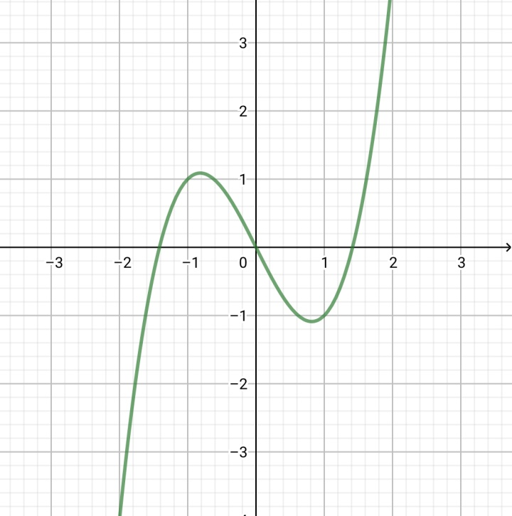
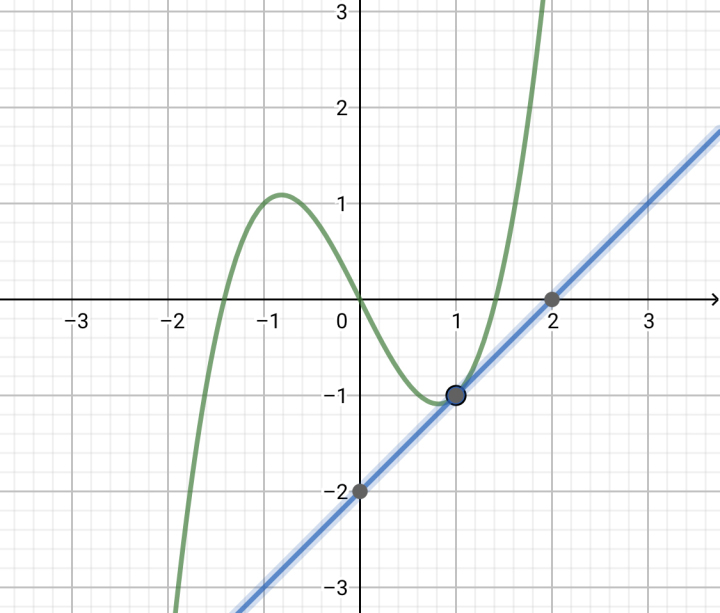
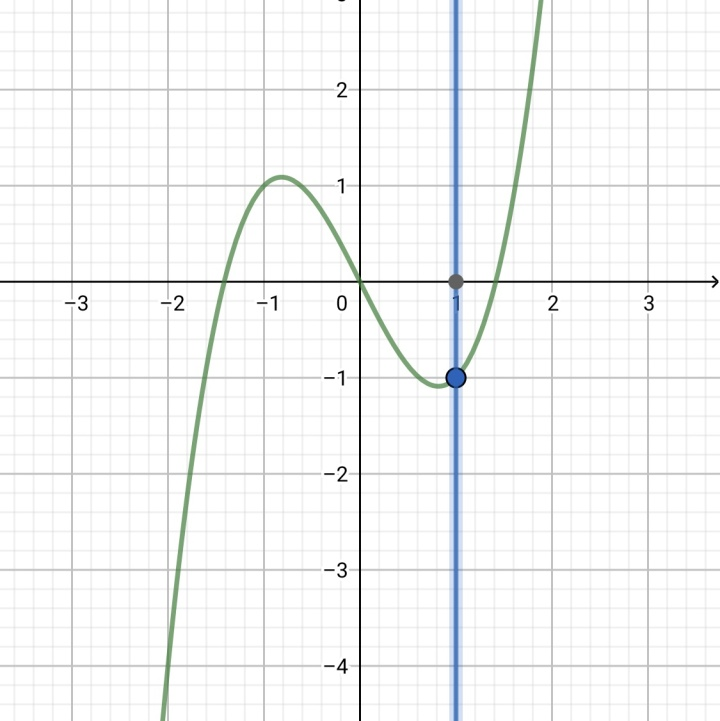
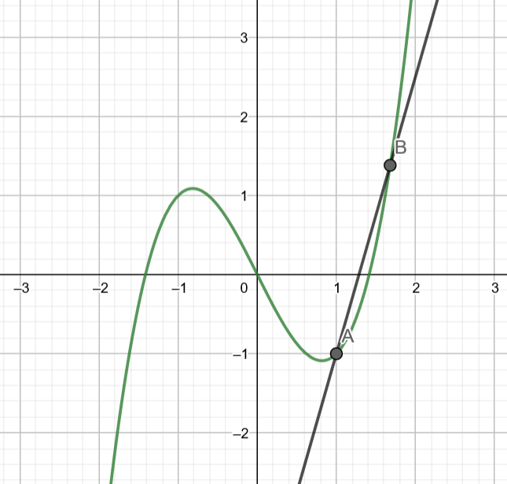
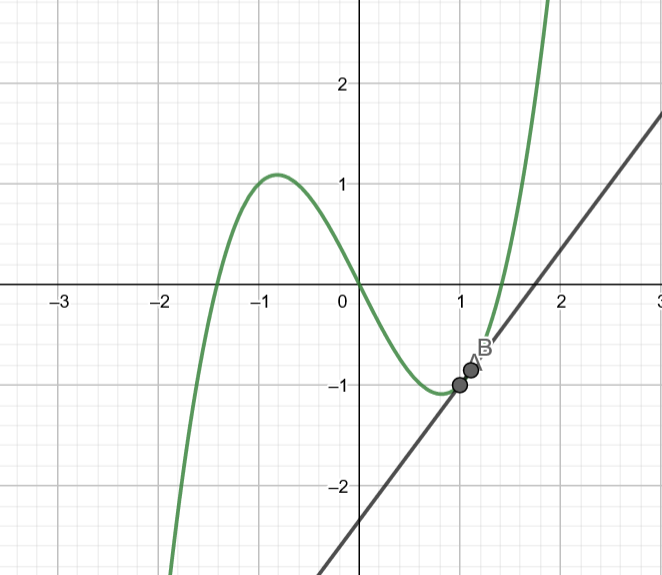
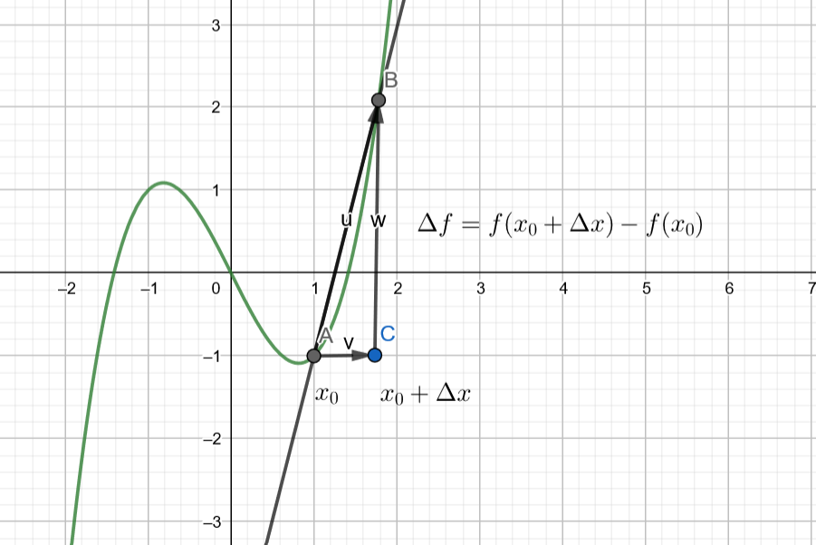

#! https://zhuanlan.zhihu.com/p/261313658

# [01-2-1]导数的定义

## 切线（tangent line）的定义和斜率（slope）

不知道大家遇没遇到这样的问题，就是函数的切线问题，这是介绍单变量微积分的常用办法

有些人可能会批评我不先讲述极限的定义，我会在下一节讲述，并直接介绍洛必达法则，注意到一些函数、映射的概念也属于高等数学的一部分，我们会在其他部分另外讲述

以下是函数$y=f(x)=x^3-2x$的函数图像，那我们想要分析其在$x=1$处的切线

其实我们很容易做到

但是，我们需要重新回顾一下我们是怎么做到的，也就是重新审视切线的定义

我们在初中就学过圆切线的定义

> 与圆相交于一点，且仅相交于一点的直线，叫做这个圆的切线

但是我们其实可以注意到在这个问题里，这个定义并不合适，比如直线$x=1$与函数也仅交于一点

所以说：切线并不是一条与原函数有唯一交点的直线

那么，既然大家都这么聪明，能想到我们是怎么定义的吗（笑）

为了解决这个问题，我们引进割线的定义：

> 任取函数图像上两点，连接这两点做一条直线，即为函数的割线

如图，上图中$AB$即为函数$y=f(x)=x^3-2x$的割线

那，我们给出切线的严格定义，即为割线的极限，完整定义如下：
> 为了做出$y=f(x)$在$x=x_0$处的切线方程，首先做出点$P(x_0,f(x_0))$，并在点$P$附近寻找一点$Q$，当$Q\to P$时，所得直线$PQ$即为所求
>
>> 上面定义中使用了大量的记号，首先注意一点，未加下标的字母$x,y$均代表变量，只有加上下标的$x_0$代表某一确定的未知常数，$y=f(x_0)$代表函数在$x_0$处的函数值，也是确定的，只不过未知

接下来的定义可能有些难以理解，Hold on Tight！

## 导数（derivative）的定义

一般来说，我们更关心如何定量表示切线，即求出切线的方程

我们已知$x=x_0$和函数$y=f(x)$，也就意味着我们知道点$P$的所有性质

唯一不确定的就是切线的斜率，既然我们不知道点$P$处切线的斜率，那我们就定义一下：（笑）

**导数的几何定义：某一函数$f(x)$在$x=x_0$处切线的斜率，记作$f^\prime(x_0)$或$\frac{df}{dx}|_{x=x_0}$，前者是牛顿的记号，后者是莱布尼兹的记号**

请大家记住这两个符号：$f^\prime(x_0)$或$\frac{df}{dx}|_{x=x_0}$，务必记住，学习单变量微积分时你会经常看到这样的记号，以后学习微分的概念时我们会拓展这个概念，现在大家只需要记牢这两个记号就可以

如果仔细观察莱布尼茨的记号，我们会发现$df/dx\approx \frac{\Delta f}{\Delta x}$，这两个记号的区别是：

$df$，$dx$是无穷小量，本质上是两个无穷小，用微商的办法来表示导数，$\Delta f$，$\Delta x$本质上是两个数，只不过很小，只有当$\Delta x\to 0$时比值才是无穷小

为了找到导数的定量定义，我们需要重新回顾一下刚才为了求得切线的作图办法：

为了定量表示各点位置，首先我们先把点$P,Q$的坐标表示出来，分别是$P(x_0,f(x_0)),Q(x_Q,f(x_Q))$

这样，直线$PQ$的斜率$k$就可以表述为：$k=\frac{f(x_Q)-f(x_0)}{x_Q-x_0}$

注意到导数的定义其实是上式$x_Q\to x_0$的极限形式，那么我们有**导数的定义式**：

$f^\prime(x_0)=\lim \limits_{x_Q\to x_0}{\frac{f(x_Q)-f(x_0)}{x_Q-x_0}}$

其中$\lim$的意思是：当满足$\lim$下面那个条件时（在这里是$x_Q\to x_0$），这个式子的值（这里是$\frac{f(x_Q)-f(x_0)}{x_Q-x_0}$），为了方便大家记忆，我们一般这样说：

当$x_Q\to x_0$时，$\frac{f(x_Q)-f(x_0)}{x_Q-x_0}$的值

一般来说，这样处理是不够的，我们将$Q$点的坐标改写成更一般的形式：$x_Q=x_0+\Delta x$

注意到这时，$x_Q\to x_0$的条件就等价于$\Delta x\to 0$，$x_Q-x_0=\Delta x$

导数的定义式变成了

$f^\prime(x_0)=\lim \limits_{x_Q\to x_0}{\frac{f(x_Q)-f(x_0)}{x_Q-x_0}}=\lim \limits_{\Delta x\to 0}{\frac{f(x_0+\Delta x)-f(x_0)}{\Delta x}}$

这就是导数的极限定义，请大家务必记住这个公式及其推导过程

这个式子是一般来说大家看到更常见的式子，我们画一个图来直观感受一下这个定义是什么意思：

**注意到现在直线$AB$是割线，只有当$\Delta x \to 0$时才是切线**

注意到如果这个函数的导数总存在的话，我们可以**记一个新函数（$f^\prime$），其函数值为原函数（$f$）的导数值，即$f^\prime (x)$，每一个函数值$f^\prime (x_0)$都是$f$在$x_0$的导数值，叫做这个函数的导函数，也简记为导数**，我们一般所说的求导就是这种求导函数的过程

$f^\prime(x)=\lim \limits_{\Delta x\to 0}{\frac{f(x+\Delta x)-f(x)}{\Delta x}}$

这个函数同样记作$\frac {dy} {dx}$

注意区分各个字母的意义：**没有下标的字母都不是具体值！！**

**大家要注意不是所有函数都可导，也不是所有函数导数的定义域与其本身的定义域都一致**

我们直接一鼓作气把一些常见的导数问题讲完吧：

## 常用导数（一部分）：

$(C)^\prime =0$，其中$C$是常数

> 注意，我们现在关于导数的公式只有定义式，那我们把$f(x)=C$带入公式：
>
> 证明：$(C)^\prime=\lim \limits_{\Delta x\to 0}{\frac{f(x+\Delta x)-f(x)}{\Delta x}}=\lim\limits_{\Delta x \to 0}\frac{C-C}{\Delta x}=0$

$(x)^\prime =1$

> 证明：
>
> $(x)^\prime=\lim \limits_{\Delta x\to 0}{\frac{f(x+\Delta x)-f(x)}{\Delta x}}\\=\lim \limits_{\Delta x \to 0}\frac{x+\Delta x-x}{\Delta x}=1$

$(kf(x))^\prime =kf^\prime(x)$

> 证明：
>
> $(kf(x))^\prime=\lim \limits_{\Delta x\to 0}{\frac{k(f(x+\Delta x)-f(x))}{\Delta x}}\\=k\lim \limits_{\Delta x\to 0}{\frac{f(x+\Delta x)-f(x)}{\Delta x}}=kf^\prime(x)$

$(f(x)+g(x))^\prime =f^\prime(x)+g^\prime(x)$

> 证明：
>
> $(f(x)+g(x))^\prime =\lim \limits_{\Delta x\to 0}{\frac{f(x+\Delta x)+g(x+\Delta x)-f(x)-g(x)}{\Delta x}}\\=\lim \limits_{\Delta x\to 0}{\frac{f(x+\Delta x)-f(x)}{\Delta x}}+\lim \limits_{\Delta x\to 0}{\frac{g(x+\Delta x)-g(x)}{\Delta x}}\\=f^\prime(x)+g^\prime(x)$

类似的，可以拓展定义到：$(f(x)\pm g(x))^\prime =f^\prime(x)\pm g^\prime(x)$

我们来一个难一点的：$(x^n)^\prime =nx^{n-1}$

> 这里我们使用一个引理，即为二项式定理：
>
> $(a+b)^n=a^n+C_n^1a^{n-1}b+\dots C_n^ia^{n-i}b^i+\dots C_n^{n-1}ab^{n-1}+b^n$
>
> 这个定理应该属于初等代数的内容，我们也不证
>
> 证明：
>
> $(x^n)^\prime =\lim \limits_{\Delta x\to 0}{\frac{f(x+\Delta x)-f(x)}{\Delta x}}\\=\lim \limits_{\Delta x\to 0}{\frac{(x+\Delta x)^n-x^n}{\Delta x}}\\=\lim \limits_{\Delta x\to 0}{\frac{nx^{n-1}\Delta x+o((\Delta x)^2)}{\Delta x}}\\=\lim \limits_{\Delta x\to 0}nx^{n-1}+o(\Delta x)=nx^{n-1}$
>
> 注意到这里$n\in N^+$，$n=0$时同样满足$(x^0)^\prime=1=0\cdot x^{-1}$（$x\neq 0$）

## 常见问题：

## 习题：
1. 对以下函数求导：
   1. $y=2x^3-5x+6$
   2. $y=x^{-1}$ （注意文中并没有证明$n\notin N^+$的情况）
2. 尝试对以下公式予以证明（下节内容，做不出来也很正常）：
   1. $(uv)^\prime=u^\prime v+uv^\prime$
   2. $(\frac u v)^\prime=\frac {u^\prime v -uv^\prime} {v^2}$

下一篇：

<https://zhuanlan.zhihu.com/p/261313501>

[repo](01-2-2.md)
