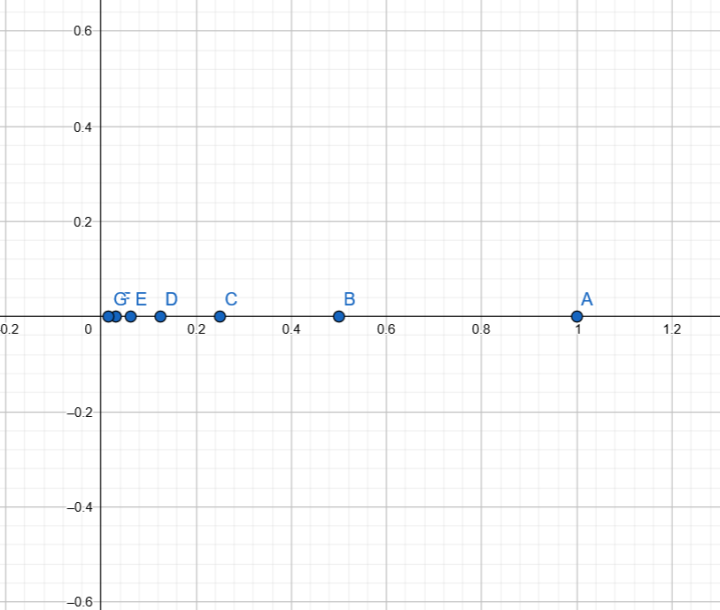
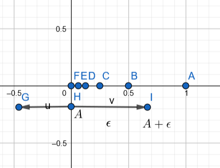
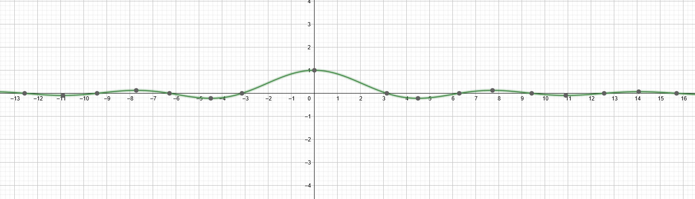
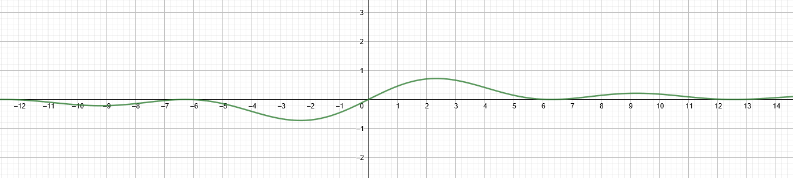
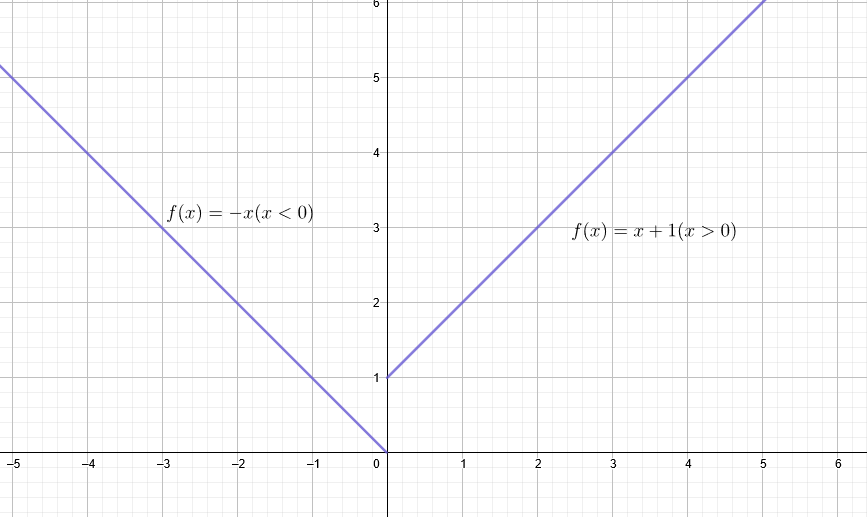
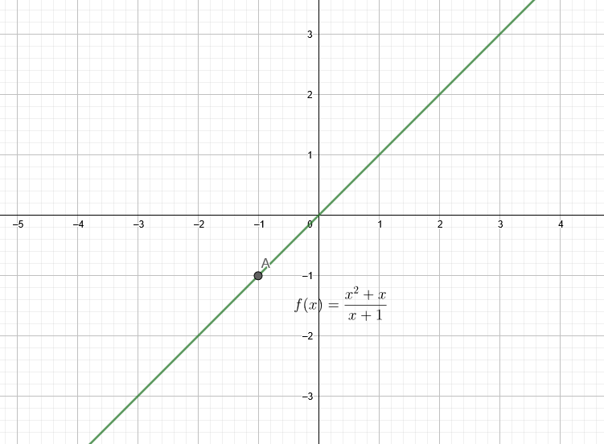

#! https://zhuanlan.zhihu.com/p/261313501

# [01-2-2] 单变量微积分|极限的定义与运算

项目总览：[知乎](https://zhuanlan.zhihu.com/p/264811260) [Repo](README.md)

上一篇：

<https://zhuanlan.zhihu.com/p/261313658>

[repo](01-2-1.md)

文章分为两部分，第一部分讲述本节内容，第二部分讲述常见问题

这篇内容讲一讲极限的定义和一些操作，以及洛必达法则

上一篇内容中已经提到了极限的概念，这里做一点补充，在实际应用之中单独求极限的情况还是不多的，只是大家考试要用

我们回顾一下初等数学中对数列的定义：
> 数列（sequence of number），是以正整数集（或它的有限子集）为定义域的函数，是一列有序的数
> 数列中的每一个数都叫做这个数列的项。排在第一位的数称为这个数列的第1项（通常也叫做首项），记作$a_1$，排在第二位的数称为这个数列的第2项，记作$a_2$，以此类推，排在第n位的数称为这个数列的第$n$项，通常用$a_n$表示

实数数列的定义:

> 若函数$f$的定义域为全体正整数集合$N^+$，则称
> $f: N^+ \to R$，$f(n),n \in N^+$
> 为数列。因正整数集$N^+$的元素可按由小到大的顺序排列，故数列$f(n)$也可写作
> $a_1,a_2,a_3,\dots ,a_n,\dots$
> 或可简单地记为$\{x_n\}$，其中称$a_n$为该数列的通项。

这样看起来很无趣对吧，我们来举几个数列的例子

> $1,2,3,4,5,\dots$，通项公式$a_n=n$
>
> $1,\frac 1 2,\frac 1 4,\frac 1 8,\frac 1 {16},\dots$，通项公式$a_n=2^{-n+1}$

有一类数列，他们会慢慢趋于一个值，且一直在这个值附近震荡，那么通俗来说，这个值就叫做数列的极限，如果不存在这样的数，则称这个极限发散

严格定义：

> 设为数列$\{x_n\}$，$a$为定数。若对任给的正数$\epsilon$，总存在正整数$N$，使得当$n > N$时有 $|a_n-A|<\epsilon$
>
> 则称数列收敛于$A$，定数$A$称为数列的极限，并记作$\lim \limits_{n\to \infin}a_n=A$
>
> 若数列没有极限，则称不收敛，或称发散

这里严格定义的内容其实是这样的，对于我们猜测的这个极限值$A$，对于任意一个长度$\epsilon$（一个慢慢变小的长度），总满足（数列$\{a_n\}$的大于第$N$项）在区间$(A-\epsilon,A+\epsilon)$内

我不知道这样是否能帮助大家理解，那我画个图来说明吧：

$1,\frac 1 2,\frac 1 4,\frac 1 8,\frac 1 {16},\dots$

我们很容易就能发现，上面这个数列收敛与0

无论$\epsilon$多么小，总有（数列$\{a_n\}$的大于第$N$项）在区间$(A-\epsilon,A+\epsilon)$这个条件成立

极限的定义我们不再多说，直接来看无穷小和无穷大的定义

如果一个数列的极限为0，那么称这个数列的极限是无穷小

无穷大的定义相较而言就更加复杂

> 设为数列$\{x_n\}$，$a$为定数。若对任给的正数$M$，总存在正整数$N$，使得当$n > N$时有 $|a_n|>M$，称这个数列的极限为无穷大

一些性质：
两个无穷小的和仍然是无穷小  
> 推论：有限个无穷小的和仍然是无穷小
无穷小与实数的乘积仍未无穷小

**不要把用于实数的结论套用在无穷小无穷大上面，因为无穷小、无穷大并不是数**

一些定义：
记$\alpha,\beta$是两个无穷小，如果：

1. $\lim\frac\alpha \beta=0$那么记$\alpha$是$\beta$的高阶无穷小
2. $\lim\frac\alpha \beta=1$那么记$\alpha$是$\beta$的等价无穷小
3. $\lim\frac\alpha \beta=k$那么记$\alpha$是$\beta$的$k$价无穷小

常见的极限：
$\lim\limits_{x\to 0} \frac {\sin x}{x}=1$
$\lim\limits_{x\to 0} \frac {1-\cos x}{x}=0$

这两个极限我们以后推导$\sin x$和$\cos x$的导数是需要用到，请大家务必记牢

上图是$\frac {\sin x}{x}$的函数图像，如果仔细考察的话，在0处该函数是没有定义的，因为分母为0，但这个函数的在0处极限为1，所以说$\sin x$和$x$是等价无穷小

同样的，我们也可以画出$\frac {1-\cos x}{x}$的函数图像，长这样：

我们会发现，在上述两个问题中，函数尽管在$x=0$处不存在定义，或者叫不连续，但是我们可以补充定义使函数连续

我们先给出函数连续性的定义，即满足以下式子的函数在$x_0$连续，在$x_0$连续的函数满足以下式子：（这里的在$x_0$处等价于$x=x_0$的去心邻域，有关去心邻域的定义请参考教科书）

$\lim\limits_{x\to x_0}f(x)=f(x_0)$

以下是常见的几种不连续的函数：

这就是一种常见的不连续的函数，但是很多函数的不连续性是“可去的”，比如下面这个例子：

注意到函数$f(x)=\frac{x^2+1}{x+1}$在$x=-1$其实并不连续，但是我们其实直觉上感觉这个极限存在，而且补充定义以后函数就会重新连续

相比之下，上面那个分段函数就无法这样实现连续

为了区别这种关系，我们补充两个定义，左极限和右极限

左极限就是从左面逼近这个值，右极限就是从右面逼近这个值，完整的定义如下：
