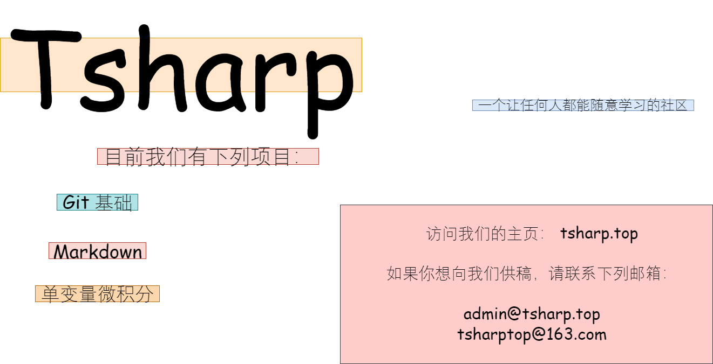

#! https://zhuanlan.zhihu.com/p/264811260

# Tsharp-02 单变量微积分

其实我很早就想要搞一个这样的文章，来给大家讲一讲学习单变量微积分中可能遇到的问题与一些习题

本笔记参考了大量的教科书，这里以高等教育出版社的高等数学为主体，参考其他教科书完成了这一篇笔记，可能会存在问题，还望大家多多反馈，教科书上有一些晦涩难懂的地方，我们多加批语，方便大家理解，批语中只是个人简介，难免存在鄙薄指出，还望海涵

这里应当提到，这个笔记在创立的时候仅仅是为了更好的让大家理解，一些地方可能会出现不严谨的地方，譬如可能会用到“附近”来代替“去心邻域”，这的确是一种不严谨的说法，偏好严谨的同学可以参考高等教育出版社的高等数学

这本笔记是用来记述我在学习单变量微积分时所用到的笔记， 大家可以拿来参考，如果有问题的话，请联系admin@tsharp.top

其实这种想法就起源于我自己学习微积分时遇到的一些困惑，希望能够给大家做一些解答

文章的所有内容都以markdown文件的形式同步于[Gitee](https://gitee.com/tsharptop/tsharp_docs)，希望大家多多star和clone，希望不要fork，PR的话请选轻量PR

有一些人可能不太了解Git的操作，我会找时间介绍一下，满足一些不需要使用Git的人的需求

希望大家积极提出问题，我会认真做解答并收录其中，我会尽量使用中文来完成大部分文章的内容，并加以英文为辅助，以后大家写论文时会回来感谢我的（笑）

我希望有人来给这个项目供稿，同样的，请联系admin@tsharp.top并备注个人信息与想投稿的内容

另外一点，不希望大家在评论区吵架，这是一个学习的地方，知乎已经很少见了，所有您内容必须加以分析，不许针对对方其人，但是可以批评对方观点

等到官网建设完毕后，文章内容会同步于平台上，届时希望大家也前去支持
