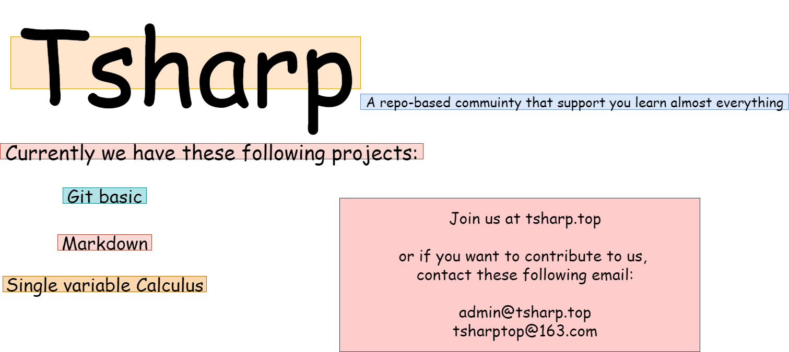

# Tsharp-teach(Project 01)

This repo is a mirror of all markdown, images, videos represented in tsharp_docs

This repo doesn't have a license, this means that you cannot republish, advertise or in any other means that shows you somehow owns this repo

You are welcome to star, or in case there is any problems, Pull a request. If you don't know the basic of git operations, see it here[01-0-README](01-0/README.md)

If you got a problem, PR like this:

"directory of the file"+The problem itself(typo/academic)+date

If no one responds to your PR, email to this address: admin@tsharp.top. Notice that the domain name might abadoned at no times

Well, good luck studying
